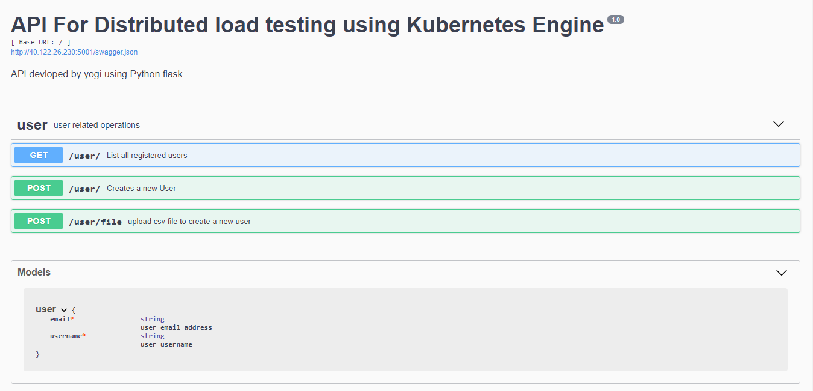

# Build API using Python Flask




The following are needed to run PythonFlask API: 

### Prerequisite: 

- [Python](https://www.python.org/downloads/) (version 3.6)
- [pip](https://pip.pypa.io/en/stable/installing/)

- Install below Python's Libraries. Create requirements.txt file and should look similar to the one below:

         pandas
         flask-bcrypt
         Flask-SQLAlchemy
         flask-restplus
         Flask-Migrate
         Flask-Script
         flask_testing
         sqlalchemy-migrate==0.7.2
         psycopg2==2.8.5
         Werkzeug==0.16.1
 
- Run below mentioned command 
  
            pip install -r requirements.txt
            
            
### Test Flask API

```bash
   
   export DATABASE_URL="postgresql://user:password@IP:5432/flaskdb"
   
   ## Initiate a migration folder, Create a migration script and Apply the migration script to the database
   
   python manage.py db init
   python manage.py db migrate --message 'initial database migration'
   python manage.py db upgrade
   
   ## Now test application to see that everything is working fine
   
   python manage.py run

          
          
     
 
